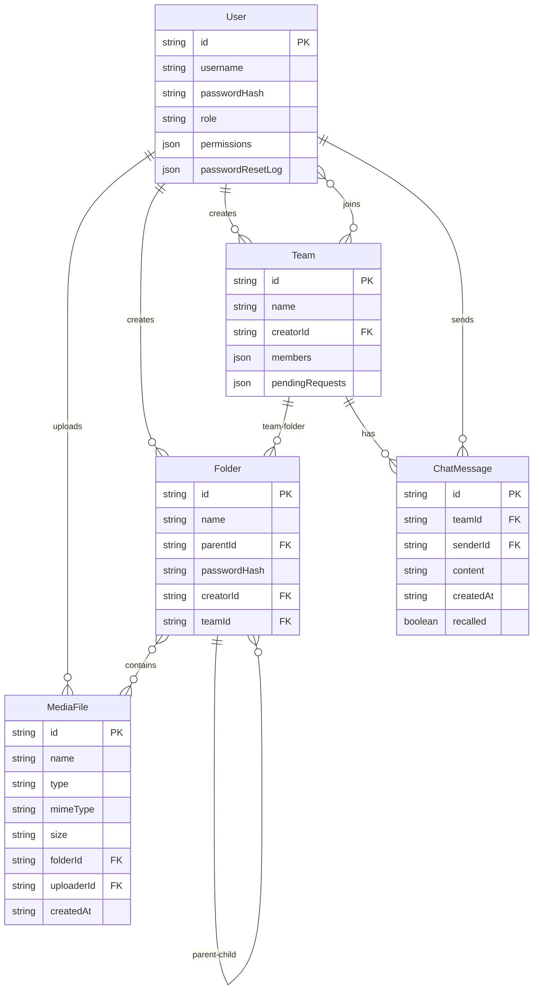

# 技术架构文档 — 硬核媒体云仓库

## 1. 架构设计

```mermaid
flowchart TD
    subgraph "前端 Frontend"
        "React 18 + TypeScript" --> "Tailwind CSS"
        "React 18 + TypeScript" --> "Zustand 状态管理"
        "React 18 + TypeScript" --> "React Router"
    end
    subgraph "后端 Backend"
        "Express 4 + TypeScript" --> "multer 文件上传"
        "Express 4 + TypeScript" --> "archiver ZIP 打包"
        "Express 4 + TypeScript" --> "JWT 认证中间件"
        "Express 4 + TypeScript" --> "权限中间件"
    end
    subgraph "数据层 Data"
        "文件系统" --> "uploads/ 文件存储"
        "JSON 元数据" --> "users.json"
        "JSON 元数据" --> "files.json"
        "JSON 元数据" --> "folders.json"
        "JSON 元数据" --> "teams.json"
        "JSON 元数据" --> "chats.json"
    end
    "前端 Frontend" -->|"REST API + JWT"| "后端 Backend"
    "后端 Backend" --> "数据层 Data"
```

## 2. 技术说明

- **前端**：React@18 + TypeScript + tailwindcss@3 + vite
- **初始化工具**：vite-init（react-express-ts 模板）
- **后端**：Express@4 + TypeScript + multer + archiver
- **状态管理**：Zustand
- **认证**：JWT（jsonwebtoken）+ bcryptjs 密码哈希
- **数据库**：无数据库依赖，使用 JSON 文件存储元数据 + 文件系统存储上传文件

## 3. 路由定义

| 路由 | 用途 |
|------|------|
| `/login` | 登录页面 |
| `/register` | 注册页面 |
| `/forgot-password` | 忘记密码页面 |
| `/` | 主页（文件/文件夹管理，需登录守卫） |
| `/admin` | 管理员面板（需 manage_users 权限守卫） |

## 4. API 定义

### 4.1 认证路由（/api/auth）

| 方法 | 路径 | 说明 | 权限 |
|------|------|------|------|
| POST | `/register` | 注册（身份码区分角色） | 公开 |
| POST | `/login` | 登录，返回 JWT | 公开 |
| POST | `/forgot-password` | 忘记密码（每月限 3 次） | 公开 |
| GET | `/users` | 获取所有用户列表 | manage_users |
| PATCH | `/users/:id/permissions` | 更新用户权限 | manage_users |
| DELETE | `/users/:id` | 注销用户账号 | manage_users 或本人 |
| GET | `/me` | 获取当前用户信息 | 已认证 |

### 4.2 文件路由（/api/files）

| 方法 | 路径 | 说明 | 权限 |
|------|------|------|------|
| GET | `/?folderId=` | 获取文件列表 | view |
| POST | `/upload` | 上传文件（multer） | upload |
| GET | `/:id/download` | 单个下载 | view |
| POST | `/batch-download` | 批量下载（archiver ZIP） | view |
| DELETE | `/:id` | 单个删除 | delete_own/delete_all |
| POST | `/batch-delete` | 批量删除 | delete_own/delete_all |
| PATCH | `/:id/rename` | 重命名 | edit_own/edit_all |
| PATCH | `/:id/move` | 移动到文件夹 | edit_own/edit_all |

### 4.3 文件夹路由（/api/folders）

| 方法 | 路径 | 说明 | 权限 |
|------|------|------|------|
| GET | `/?parentId=` | 获取文件夹列表 | view |
| POST | `/` | 创建文件夹 | folder_create |
| PATCH | `/:id/rename` | 重命名文件夹 | edit_own/folder_manage_all |
| DELETE | `/:id` | 删除文件夹（需密码） | folder_manage_all 或本人 |
| POST | `/:id/password` | 设置/修改文件夹密码 | folder_manage_all |
| POST | `/:id/verify` | 验证文件夹密码 | view |

### 4.4 团队路由（/api/teams）

| 方法 | 路径 | 说明 | 权限 |
|------|------|------|------|
| GET | `/` | 获取团队列表 | 已认证 |
| POST | `/` | 创建团队（每人最多 3 个） | 已认证 |
| POST | `/:id/join` | 申请加入团队 | 已认证 |
| POST | `/:id/approve/:userId` | 审批通过 | 团队创建者 |
| POST | `/:id/reject/:userId` | 审批拒绝 | 团队创建者 |
| DELETE | `/:id/members/:userId` | 踢出成员 | 团队创建者 |
| POST | `/:id/folder` | 创建团队文件夹 | 团队创建者 |
| GET | `/:id/access` | 检查团队文件夹访问权限 | 已认证 |

### 4.5 聊天路由（/api/chat）

| 方法 | 路径 | 说明 | 权限 |
|------|------|------|------|
| GET | `/:teamId` | 获取团队聊天历史 | 团队成员 |
| POST | `/:teamId` | 发送消息 | 团队成员 |
| DELETE | `/:teamId/:messageId` | 撤回消息（2 分钟内） | 消息发送者 |
| GET | `/unread` | 获取未读消息数 | 已认证 |
| POST | `/:teamId/read` | 标记已读 | 团队成员 |

## 5. 服务器架构图

```mermaid
flowchart LR
    "Controller 路由层" --> "Service 服务层"
    "Service 服务层" --> "Repository 数据层"
    "Repository 数据层" --> "JSON 文件存储"
    "Controller 路由层" --> "Auth 中间件"
    "Auth 中间件" --> "权限校验"
```

- **路由层（routes/）**：接收请求、参数校验、调用服务
- **中间件（middleware/）**：JWT 解析 + 权限实时读取校验
- **服务层（services/）**：业务逻辑（permissions/userService/fileService/folderService/teamService/chatService）
- **数据层**：JSON 文件读写（无 ORM，直接 fs 操作）

## 6. 数据模型

### 6.1 数据模型定义



### 6.2 数据定义

**users.json**
```json
{
  "users": [
    {
      "id": "uuid",
      "username": "string",
      "passwordHash": "bcrypt_hash",
      "role": "admin | user",
      "permissions": ["view","upload","edit_own","delete_own","folder_create"],
      "passwordResetLog": { "2026-06": 0 }
    }
  ]
}
```

**files.json**
```json
{
  "files": [
    {
      "id": "uuid",
      "name": "string",
      "type": "video | image | audio | document | archive",
      "mimeType": "string",
      "size": 0,
      "folderId": "string | null",
      "uploaderId": "uuid",
      "createdAt": "ISO8601"
    }
  ]
}
```

**folders.json**
```json
{
  "folders": [
    {
      "id": "uuid",
      "name": "string",
      "parentId": "string | null",
      "passwordHash": "bcrypt_hash | null",
      "creatorId": "uuid",
      "teamId": "string | null"
    }
  ]
}
```

**teams.json**
```json
{
  "teams": [
    {
      "id": "uuid",
      "name": "string",
      "creatorId": "uuid",
      "members": ["uuid"],
      "pendingRequests": ["uuid"]
    }
  ]
}
```

**chats.json**
```json
{
  "messages": [
    {
      "id": "uuid",
      "teamId": "uuid",
      "senderId": "uuid",
      "content": "string",
      "createdAt": "ISO8601",
      "recalled": false
    }
  ]
}
```

## 7. 权限常量（9 种）

| 权限键 | 标签 | 普通用户默认 | 管理员默认 |
|--------|------|:---:|:---:|
| `view` | 查看文件 | ✅ | ✅ |
| `upload` | 上传文件 | ✅ | ✅ |
| `edit_own` | 编辑自己的文件 | ✅ | ✅ |
| `edit_all` | 编辑所有文件 | ❌ | ✅ |
| `delete_own` | 删除自己的文件 | ✅ | ✅ |
| `delete_all` | 删除所有文件 | ❌ | ✅ |
| `folder_create` | 创建文件夹 | ✅ | ✅ |
| `folder_manage_all` | 管理所有文件夹 | ❌ | ✅ |
| `manage_users` | 管理用户账号 | ❌ | ✅ |

## 8. 文件类型识别（5 种）

| 类型 | 扩展名 |
|------|--------|
| video | mp4, webm, mov, avi, mkv, flv, wmv, m4v, 3gp, ts, mpeg, mpg |
| image | jpg, png, gif, webp, svg, bmp, tiff, avif, heic, heif |
| audio | mp3, wav, ogg, flac, aac, m4a, wma, mid, midi |
| document | pdf, doc, docx, xls, xlsx, ppt, pptx, txt, csv, rtf |
| archive | zip, rar, 7z, tar, gz |
